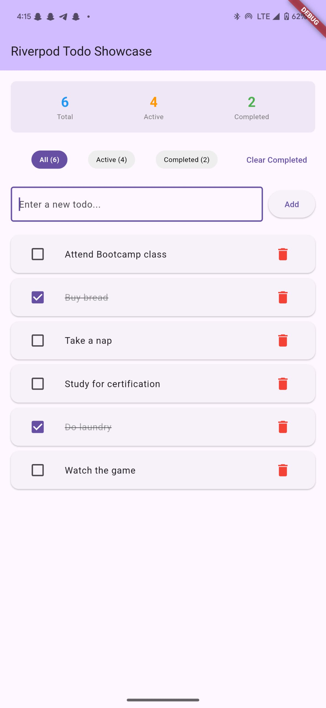
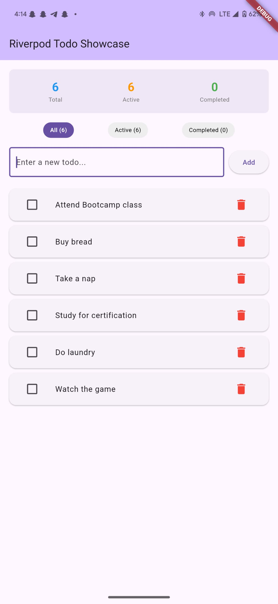

# 📝 Flutter Riverpod Todo App

A simple yet complete **Todo application** built with **Flutter** and **Riverpod** to demonstrate core state management concepts.  
This project is not intended for production use but rather as a learning tool for understanding **StateProvider**, **StateNotifierProvider**, **Provider**, and reactive UI with **ConsumerWidget**.

---

## 🚀 Features

### ✅ Core Features (Must-Have)
1. **Add Todos** — Create new todos with a text input.
2. **Mark as Complete/Incomplete** — Use checkboxes to toggle todo status.
3. **Delete Todos** — Remove todos with a delete button.
4. **Todo Count** — Display total, completed, and pending counts.
5. **Filter Todos** — View **All**, **Active**, or **Completed** tasks.

### 🎯 Bonus Features (Optional)
- Clear all completed todos.
- Edit existing todos.
- Simple persistence with **SharedPreferences**.
- Demonstrates:
    - `ref.watch()` vs `ref.read()`
    - **State immutability principles**

---

## 📸 Screenshots

| Home Screen                          | Active Filter                            | Completed Filter                               |
|--------------------------------------|------------------------------------------|------------------------------------------------|
|  |  |  |

---

## 🛠️ Tech Stack
- **Flutter** — UI toolkit for building natively compiled apps.
- **Riverpod** — Robust state management solution.
- **Dart** — Programming language for Flutter.
- **SharedPreferences** (optional) — Local persistence.

---


---

### 🧩 File & Folder Descriptions

#### **`lib/main.dart`**
- The **entry point** of the application.
- Wraps the app in `ProviderScope` to enable Riverpod.

#### **`lib/models/todo.dart`**
- Defines the `Todo` class (id, title, isCompleted).
- Includes a `copyWith()` method for **immutable state updates**.

#### **`lib/providers/todo_providers.dart`**
Implements Riverpod state management:

1. **`TodoListNotifier`** — `StateNotifier` managing a `List<Todo>`.
    - **`addTodo()`** — Adds a new todo.
    - **`toggleTodo()`** — Marks a todo as complete/incomplete.
    - **`deleteTodo()`** — Deletes a todo.
    - **`clearCompleted()`** — Removes all completed todos.

2. **`todoListProvider`** — `StateNotifierProvider` exposing the todo list.

3. **`TodoFilter` & `todoFilterProvider`** — `StateProvider` to store the current filter (`all`, `active`, `completed`).

4. **`filteredTodosProvider`** — `Provider` that returns todos based on the active filter.

5. **`todoStatsProvider`** — `Provider` returning a `TodoStats` object with:
    - `total` — Number of all todos.
    - `completed` — Number of completed todos.
    - `active` — Number of active (pending) todos.

#### **`lib/screens/home_screen.dart`**
- The main UI screen showing:
    - Todo list
    - Filter controls
    - Statistics

#### **`lib/widgets/`**
- **`todo_item.dart`** — Displays a single todo with checkbox & delete button.
- **`todo_list.dart`** — Displays the filtered list of todos.
- **`todo_input.dart`** — Text input and add button for creating todos.

---

## ▶️ Getting Started

### Prerequisites
- Flutter SDK installed
- Dart SDK installed
- Android Studio / VS Code with Flutter plugin

### Installation
```bash
git clone https://github.com/yourusername/flutter_riverpod_todo.git
cd flutter_riverpod_todo
flutter pub get


